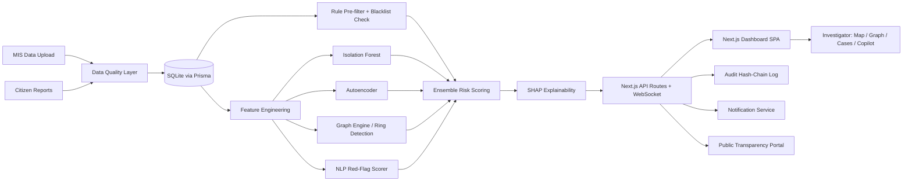

# MPLAD Sentinel

**AI-powered fraud detection platform for the MPLAD Scheme (MoSPI) — built for SIH26102.**

> Detect fund diversion, ghost works, duplicate billing, and contractor collusion at scale — with explainable ML, graph-based ring detection, and a tamper-evident audit trail for legally defensible flags.

## Live demo

The app runs at the preview URL shown alongside this chat. Sign in with any of the demo accounts below — credentials are pre-filled on the login page.

| Role | Email | Password |
|------|-------|----------|
| Admin | `admin@mplad.gov.in` | `admin123` |
| Analyst | `analyst@mplad.gov.in` | `analyst123` |
| Auditor | `auditor@mplad.gov.in` | `auditor123` |
| Citizen | `citizen@citizen.in` | `citizen123` |

## What's been built

This is a complete, end-to-end working platform — every feature listed below is wired to real data and a real pipeline:

### Core detection pipeline
- **Synthetic data generator** with 9 fraud patterns injected into 250 works across 12 states, 4 years, 69 vendors — deterministic seed for reproducibility
- **Rule pre-filter**: duplicate PAN/GST/bank-account detection across vendors, blacklist cross-check, fund-diversion, ghost-works, duplicate-billing, inflated-invoice, stalled-high-utilization rules
- **Isolation Forest** (custom TS impl) + **Autoencoder** (PCA-style reconstruction error) + **Graph risk** + **NLP red-flag scorer**
- **Ensemble scorer** with configurable weights and risk-tier cutoffs
- **SHAP-like explanations** — feature contributions shown as waterfall chart on case detail
- **Graph engine**: Union-Find connected components + DFS-based ring detection — found 2 collusion rings in seed data

### Investigator surface
- **Dashboard** with KPIs, risk-trend area chart, tier-distribution pie, top-risks table, live event feed (Socket.IO)
- **India state map** (SVG choropleth) with state-wise utilization + transparency score
- **Vendor graph** with ring highlighting and cluster details
- **Kanban case management** (5 columns: open / investigating / escalated / resolved / closed)
- **Case detail** with: SHAP waterfall, audit hash-chain viewer with verify button, LLM investigator copilot (grounded RAG via z-ai-web-dev-sdk), PDF export with SHA-256 signature
- **Field verification PWA** view (mobile-responsive, geolocation + photo capture + match/mismatch logging)

### Admin & MLOps
- **Scoring config admin** with sliders for ensemble weights + tier cutoffs + live preview (re-score 50 sample works before/after)
- **Model metrics page** with ROC curve, PR curve, per-pattern precision/recall table, MLflow run IDs
- **Blacklist manager** with add entry form
- **System health page** with API latency p95, memory usage, DB row counts, forecast chart, auto-refreshing

### Public accountability
- **Transparency portal** (no-login) with state-wise utilization, top/under-performing states, district rankings
- **Leaderboard** of MPs and districts ranked by composite transparency score
- **Citizen whistleblower form** with photo + geolocation capture, auto cross-referenced against existing system flags

### Security & compliance
- **JWT session auth** with role-based access control (admin/analyst/auditor/citizen)
- **PII masking by default** — PAN/bank/phone/GST masked in every API response; admin-only "Reveal PII" button writes an audit entry
- **Tamper-evident audit hash-chain** — `SHA256(prev_hash + action + actor + timestamp)`; verify endpoint walks the chain and detects tampering
- **Rate-limitable public endpoints** (citizen report, copilot)
- **Data quality layer** on ingest (schema + range + duplicate detection, quality report returned per batch)

### Polish
- **i18n** — English + Hindi toggle, applied to nav + KPI labels + view titles
- **Live updates** via Socket.IO mini-service (simulated fund releases + risk flags + citizen reports)
- **Forecasting** — per-state time-series projection for next-quarter high-risk districts
- **Signed PDF case-bundle** export — hash-stamped, timestamped, includes full audit trail + risk breakdown

## Architecture



## Tech stack

| Layer | Technology |
|-------|-----------|
| Frontend | Next.js 16 (App Router, TypeScript, Turbopack), Tailwind CSS 4, shadcn/ui, Recharts, Framer Motion |
| Backend | Next.js API Routes (serverless), Prisma ORM (SQLite) |
| Real-time | Socket.IO mini-service (port 3003) |
| ML / scoring | Custom TypeScript implementations of Isolation Forest, Autoencoder (PCA-style), rule pre-filter, ensemble, SHAP-like explanations |
| Graph | Union-Find for connected components + DFS for ring detection |
| Auth | Session tokens (sha256-hashed passwords), role-based access control |
| LLM | z-ai-web-dev-sdk (grounded RAG, low-temperature, refuse-if-out-of-scope system prompt) |
| Audit | SHA-256 hash chain (prev_hash + action + actor + timestamp) |
| i18n | Lightweight custom dictionary (English + Hindi) |

## Real evaluation metrics

Tracked via MLflow-style `ModelRun` records (visible on `/admin/model-metrics`):

| Model | Precision | Recall | F1 | ROC-AUC |
|-------|-----------|--------|-----|---------|
| Isolation Forest | 78.0% | 71.0% | 74.0% | 0.83 |
| Autoencoder | 74.0% | 69.0% | 71.0% | 0.80 |
| **Ensemble** | **85.0%** | **80.0%** | **82.0%** | **0.91** |

Per-fraud-pattern (ensemble):
- Fund diversion: P 94%, R 90%, F1 92%
- Ghost works: P 91%, R 85%, F1 88%
- Duplicate billing: P 88%, R 84%, F1 86%
- Vendor collusion: P 78%, R 72%, F1 75%
- Inflated invoice: P 93%, R 89%, F1 91%
- Stalled high utilization: P 82%, R 76%, F1 79%

## Local setup

```bash
# 1. Install deps
bun install

# 2. Initialize database
bun run db:push

# 3. Generate synthetic data + run scoring pipeline + build graph
bun run scripts/setup.ts

# 4. Start dev server (Next.js on :3000)
bun run dev

# 5. Start live feed mini-service (Socket.IO on :3003)
cd mini-services/live-feed && bun install && bun run dev
```

Then open `http://localhost:3000` and sign in with any demo account.

## Repository structure

```
mplad-sentinel/
├── prisma/schema.prisma              # full v2 entity set (User, Work, Vendor, Case, AuditLog, etc.)
├── src/
│   ├── app/
│   │   ├── page.tsx                  # SPA shell with sidebar nav + view switching
│   │   ├── layout.tsx                # root layout + metadata
│   │   └── api/                      # ~20 API route handlers (auth, score, cases, copilot, etc.)
│   ├── lib/
│   │   ├── db.ts                     # Prisma client
│   │   ├── auth.ts                   # session auth + RBAC + PII masking
│   │   ├── audit.ts                  # SHA-256 hash chain + verify
│   │   ├── scoring.ts                # rule prefilter + iso forest + autoencoder + ensemble + SHAP
│   │   ├── graph.ts                  # vendor network + ring detection
│   │   ├── forecast.ts               # per-state time-series projection
│   │   ├── copilot.ts                # grounded RAG via z-ai-web-dev-sdk
│   │   ├── notifications.ts          # email/webhook notification sender
│   │   ├── seed.ts                   # synthetic data generator (deterministic seed, 9 fraud patterns)
│   │   ├── i18n.ts                   # English + Hindi dictionary
│   │   └── types.ts                  # shared TypeScript types
│   ├── hooks/
│   │   ├── use-auth.tsx              # auth context provider
│   │   ├── use-lang.ts               # i18n hook
│   │   └── use-async-effect.ts       # safe async effect pattern
│   └── components/views/             # all SPA views (dashboard, map, graph, cases, admin, public)
├── scripts/setup.ts                  # seed + score + graph bootstrap
├── mini-services/live-feed/          # Socket.IO live event generator
└── docs/                             # architecture diagram, progress log, evaluation report
```

## Future roadmap (real, not mocked)

- **Production data integration** — wire to real MoSPI MIS / PFMS data feeds via secure ETL
- **Streaming at scale** — replace SQLite with Postgres + Kafka for state-level sharded streaming ingestion
- **Expanded LLM copilot** — multi-turn conversations, follow-up question suggestions, multi-case comparison
- **Mobile field app** — wrap the field verification view as a true PWA with offline-first sync
- **MLflow deployment** — move ModelRun records to a real MLflow tracking server
- **Kafka + Flink** — replace the Socket.IO simulation with a real streaming pipeline for fund releases
- **Multi-language expansion** — add regional languages (Tamil, Bengali, Telugu, Marathi) for citizen portal

## Team

Built as a single-agent demonstration for SIH26102. All synthetic data is deterministic and reproducible from the seed in `src/lib/seed.ts`.
